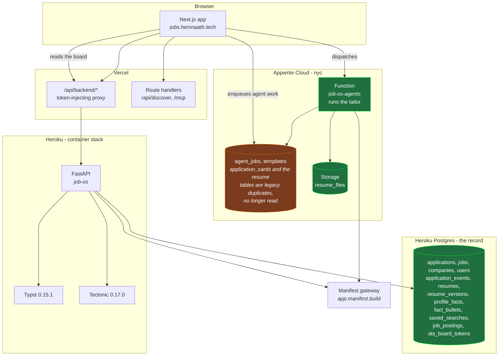

# Architecture

Three deploy targets and one store that owns each fact: **Postgres is the
record, Appwrite holds files and long-running agent work.**

Everything below was read off the running system rather than the design intent.
Where the two disagree, this records the running system.

> **Reversed on 2026-09-01.** This file previously documented the opposite rule,
> "anything the board displays is written to Appwrite", with Postgres as the
> secondary store. That rule caused real data loss and has been withdrawn. The
> section "What the old split cost" below keeps the account, because the reasons
> are the argument for the current shape and are worth not rediscovering.

## The shape

## The two-store split

This is the thing to internalise before changing anything user-facing.

**Postgres owns every fact the product queries.** Applications, their status and
audit log, jobs, companies, resumes, resume versions, profile facts, fact
bullets, saved searches and the crawl index. `api.listApplications()` routes to
the FastAPI service, which reads Postgres.

**Appwrite owns bytes and long jobs.** Rendered resume PDFs in Storage, the
`job-os-agents` function, and the `agent_jobs` rows the browser enqueues and
polls. Nothing the board displays is read from an Appwrite table.

The switch is still in the code and still works. `lib/appwrite/config.ts` reads
`NEXT_PUBLIC_PIPELINE_BACKEND` and `NEXT_PUBLIC_WORKSPACE_BACKEND`; anything
other than `appwrite` selects the Postgres path, and
`scripts/backend-switch.sh {legacy|appwrite|status}` flips both and redeploys.
The redeploy is part of the switch, because `NEXT_PUBLIC_*` is inlined at build
time. Production runs the Postgres path.

`application_cards` and the duplicate `resumes`, `resume_versions`,
`profile_facts` and `fact_bullets` tables still exist in Appwrite. They are
historical, not authoritative, and hold status changes made before 2026-09-01
that have not yet been reconciled back. **Do not write to them and do not add
new duplicates.**

## What the old split cost

Kept because the reasons are the argument for the current shape.

The previous rule was the inverse: the board rendered Appwrite
`application_cards`, and Postgres was described as "correct for jobs discovery,
the MCP tools, ingest and the scraper, none of which the board renders
directly". Two failures came out of it.

**Reads are metered per row.** Appwrite bills database reads by rows returned,
not by API call, so the crawl index was in the worst possible place: one sweep
read 8,297 rows before anyone searched. An exact-count query walked the whole
posting table and spent a month of quota in an afternoon. The quota is shared
across the organisation, so the applications board, resumes and tailoring all
went down together, and the billing cycle had 23 days left to run.

**Two stores meant one of them silently stopped being written.**
`createApplication` wrote Postgres then mirrored to Appwrite, but
`patchApplication` and `archiveApplication` wrote Appwrite alone. Creates were
durable and every edit after them was not. Measured when the outage forced the
board onto Postgres: 39 of 68 applications had never been updated since insert,
`next_action_at` was null on all 68, and all 9 applications carrying a tailored
resume still read `wishlist`. About three weeks of pipeline movement existed
only in the display copy.

Both are fixed. Writes go through one helper that runs the durable write first
and treats a failed mirror as a display lag rather than a failed edit. The
deeper fix is the rule at the top of this file: **no table exists in both
stores**, which makes the divergence unrepresentable rather than merely
survivable.

An earlier version of this file said six Postgres applications had no card. That
was wrong: it came from comparing against active cards alone and never checking
the archived ones. If you are comparing the two stores, compare against active
**and** archived, and match on application id rather than company name.

## Deploying

Three targets, three mechanisms, and they do not move together.

| Target | What | How |
|---|---|---|
| **Vercel** | `apps/web` | Builds from `main` on push. The custom domain does not always follow: check the alias after a deploy. |
| **Heroku** | `apps/api` | Manual. `container` stack, so no git push. Build `--platform linux/amd64`, `docker save`, `crane push`, `heroku container:release`. Plain `docker push` is rejected by Heroku's registry. |
| **Appwrite** | `apps/functions/job-os-agents` | Manual, and not via `appwrite push function`: there is no `appwrite.json` in this repo. Use `POST /v1/functions/{id}/deployments/vcs`. |

Pass `--build-arg GIT_SHA="$(git rev-parse HEAD)"` on the Heroku build so
`/health` reports what is actually running. Post-release, `/health` should carry
the sha, `/api/v1/applications` should answer 401 (a 503 means Clerk config did
not reach the dyno), and `/health/ready` should answer 200.

**The function's build installs `apps/api`**, so a change to
`services/tailor.py` needs the Appwrite redeploy, not just the Heroku release.
The production tailor runs inside the function, not on the container.

## Rendering

`RENDER_ENGINE=typst` in the image. Per template:

| Engine | Templates |
|---|---|
| **Typst 0.15.1** | jakes, sb2nov, awesome-cv, altacv, deedy, dashline |
| **Tectonic 0.17.0** | moderncv, husky, and every custom or uploaded template |

Typst is roughly two orders of magnitude faster. A template opts in with
`typst_ready` in `latex_catalog.py`; anything else falls through to Tectonic,
which is also where the sandboxing for model-written and user-uploaded templates
lives (`--untrusted`, a forbidden-command screen, a scrubbed environment).

Builtin template rows in Appwrite deliberately carry an empty `latex_source`.
The template itself stays in the container, so there is no second copy free to
drift from the one that actually renders.

## Models

Every LLM call goes through the Manifest gateway, selected by an
`x-manifest-tier` header rather than the model id, except on the fast tier which
does honour the id.

| Tier | Used by |
|---|---|
| `job-os-fast` | JD parsing, profile extraction, smart search |
| `job-os-sonnet` | Resume tailoring, review and revision |

`ANTHROPIC_MODEL_EXTRACT` is pinned to `claude-haiku-4-5`. It was unset, which
fell back to a `manifest/auto` placeholder that this tier answers with a 200 and
no usable content, so a parse failure looked exactly like a posting that named
nothing.

Interactive parses are bounded by the caller's own budget rather than a fixed
timeout, because they sit inside Heroku's hard 30 second router ceiling. Long
work that cannot fit that ceiling belongs in the Appwrite agent-job pattern,
which is how tailoring already runs.

## Keeping this honest

Update this file in the same PR as any architectural change: a new store, a
moved boundary, a changed deploy path, a new engine. If a diagram here is wrong,
it is worse than no diagram, because it is the thing someone will trust instead
of reading the code.
