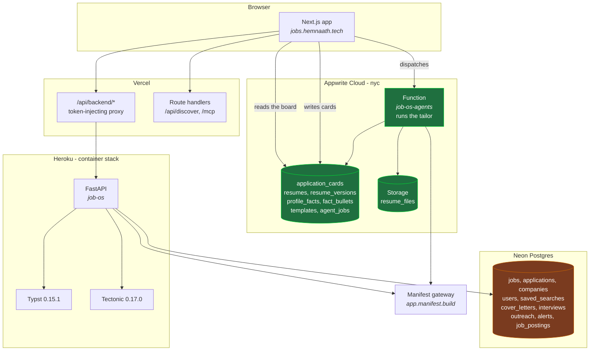

# Architecture

Three deploy targets, two databases, and one split that explains most of the
surprises: **the board you look at reads Appwrite, and half the backend writes
Postgres.**

Everything below was read off the running system rather than the design intent.
Where the two disagree, this records the running system.

## The shape

## The two-store split

This is the thing to internalise before changing anything user-facing.

`NEXT_PUBLIC_PIPELINE_BACKEND` is `appwrite` in production. So
`api.listApplications()` routes to the Appwrite pipeline, and **the Applications
board renders Appwrite `application_cards`**. Each card's `snapshot` column is
free-form JSON holding an entire `Application`, including an embedded `job`.

The FastAPI service on Heroku reads and writes **Postgres**. Both stores carry
tables of the same name: `resumes`, `resume_versions`, `profile_facts`,
`fact_bullets` exist in each.

**Consequence: writing a Postgres row that the board displays is invisible.**
This cost a whole feature. Paste-to-enrich originally wrote the Postgres `jobs`
row, the fields filled correctly, and the panel kept reading "Not set", because
nothing on that screen reads Postgres. The fix was to have the server plan the
change and the browser write the card.

**Rule: anything the board displays is written to Appwrite.** Postgres is
correct for jobs discovery, the MCP tools, ingest and the scraper, none of which
the board renders directly.

The two have also drifted apart in both directions. As measured on 2026-08-25,
there were 40 active cards against 32 active Postgres applications: 14 cards had
no Postgres row, and 6 Postgres applications had no card. That is a live data
problem, not a design feature, and it is not resolved.

## Deploying

Three targets, three mechanisms, and they do not move together.

| Target | What | How |
|---|---|---|
| **Vercel** | `apps/web` | Builds from `main` on push. The custom domain does not always follow: check the alias after a deploy. |
| **Heroku** | `apps/api` | Manual. `container` stack, so no git push. Build `--platform linux/amd64`, `docker save`, `crane push`, `heroku container:release`. Plain `docker push` is rejected by Heroku's registry. |
| **Appwrite** | `apps/functions/job-os-agents` | Manual, and not via `appwrite push function`: there is no `appwrite.json` in this repo. Use `POST /v1/functions/{id}/deployments/vcs`. |

Pass `--build-arg GIT_SHA="$(git rev-parse HEAD)"` on the Heroku build so
`/health` reports what is actually running. Post-release, `/health` should carry
the sha, `/api/v1/applications` should answer 401 (a 503 means Clerk config did
not reach the dyno), and `/health/ready` should answer 200.

**The function's build installs `apps/api`**, so a change to
`services/tailor.py` needs the Appwrite redeploy, not just the Heroku release.
The production tailor runs inside the function, not on the container.

## Rendering

`RENDER_ENGINE=typst` in the image. Per template:

| Engine | Templates |
|---|---|
| **Typst 0.15.1** | jakes, sb2nov, awesome-cv, altacv, deedy, dashline |
| **Tectonic 0.17.0** | moderncv, husky, and every custom or uploaded template |

Typst is roughly two orders of magnitude faster. A template opts in with
`typst_ready` in `latex_catalog.py`; anything else falls through to Tectonic,
which is also where the sandboxing for model-written and user-uploaded templates
lives (`--untrusted`, a forbidden-command screen, a scrubbed environment).

Builtin template rows in Appwrite deliberately carry an empty `latex_source`.
The template itself stays in the container, so there is no second copy free to
drift from the one that actually renders.

## Models

Every LLM call goes through the Manifest gateway, selected by an
`x-manifest-tier` header rather than the model id, except on the fast tier which
does honour the id.

| Tier | Used by |
|---|---|
| `job-os-fast` | JD parsing, profile extraction, smart search |
| `job-os-sonnet` | Resume tailoring, review and revision |

`ANTHROPIC_MODEL_EXTRACT` is pinned to `claude-haiku-4-5`. It was unset, which
fell back to a `manifest/auto` placeholder that this tier answers with a 200 and
no usable content, so a parse failure looked exactly like a posting that named
nothing.

Interactive parses are bounded by the caller's own budget rather than a fixed
timeout, because they sit inside Heroku's hard 30 second router ceiling. Long
work that cannot fit that ceiling belongs in the Appwrite agent-job pattern,
which is how tailoring already runs.

## Keeping this honest

Update this file in the same PR as any architectural change: a new store, a
moved boundary, a changed deploy path, a new engine. If a diagram here is wrong,
it is worse than no diagram, because it is the thing someone will trust instead
of reading the code.
