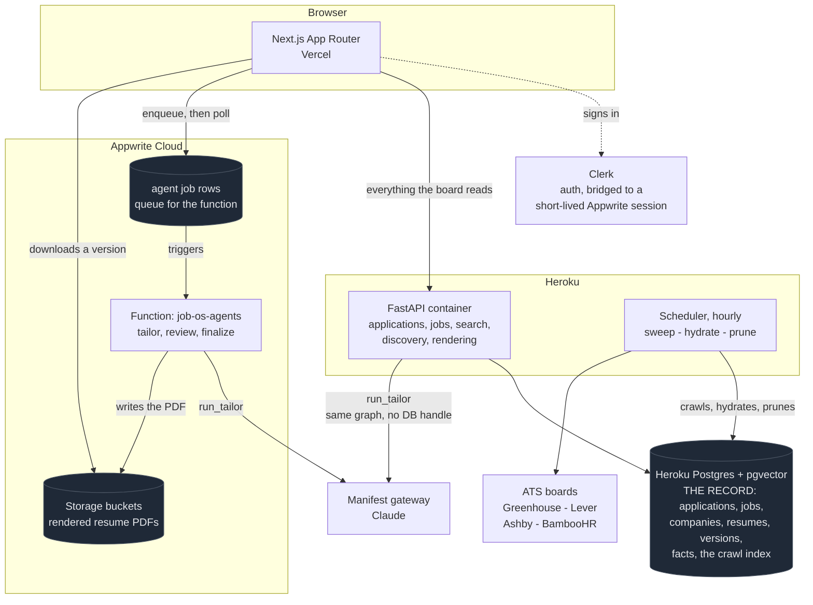

# job.os

A personal AI job-search platform, live at [jobs.hemnaath.tech](https://jobs.hemnaath.tech).

It does three things:

1. **Tracks applications.** Add a role from its URL, then move it through a Kanban
   board or work it in a table.
2. **Tailors resumes.** An agent rewrites a master resume against one specific
   posting, grounded strictly in facts the resume or profile already verifies.
3. **Finds roles, and scores them against you.** A crawler sweeps Greenhouse,
   Lever, Ashby and BambooHR hourly and stores what it finds, so a search reads
   an index instead of fetching the internet live. Every result is
   scored against your verified profile, so the page leads with what fits rather
   than what is newest.

The tracker is a tracker. The tailoring engine is the part worth reading.

## Finding roles

The default search reads a pre-built index (`apps/api/src/job_os/ingest/`,
`docs/ingest-index.md`) crawled hourly from the public board APIs of Greenhouse,
Lever, Ashby and BambooHR, roughly 20,900 company boards, with per-token
liveness tracking so a dead board is not re-checked on every sweep. Reading the
index is one query, typically under 300ms even at tens of thousands of rows; the
fan-out this replaced could take 8 to 60 seconds and download over 100MB per
search.

The index is deliberately not exhaustive. Postings are dropped past a 30 day
horizon and a hard row ceiling is enforced oldest-first, so it stays a useful
size rather than an ever-growing one. `oracle_cloud` and `workday` were crawled
and then removed on measurement: Oracle held 65% of the index to answer 27
relevant postings, and Workday returned nothing at all from its 13 boards.

**Live sources stay available, as a second, explicit step.** TheirStack, GitHub,
and any keyed or custom endpoint you add are not in the hourly crawl yet, so
Job Finder keeps a collapsed "Also search live sources" section that still fans
out to them on demand for broader, slower coverage. These are read through a
single shape adapter rather than a parser per provider: it locates the job array
under any of a dozen wrapper keys and maps fields by alias, so `job_title`,
`jobTitle` and `position` all resolve, and adding a feed is a line of config.
The same adapter reads a custom endpoint you host, POST or GET.

### Fit scoring

Each posting is scored on the skills it names against the skills your profile
verifies, with aliases so `k8s` matches Kubernetes and `retrieval augmented
generation` matches RAG. It is deterministic and runs in the browser, so a whole
page ranks instantly and costs nothing.

Two details matter more than the number:

- **A thin posting cannot score highly.** Dividing by the skills a posting names
  rewards it for naming few, and a mechanical engineering role that mentions
  three things you happen to know is not a perfect match. The denominator has a
  floor, so few signals reads as low confidence rather than a high score.
- **A posting with no description says so.** Some sources list a title and a link
  and nothing else. Those are marked rather than scored, because a title alone is
  not enough to judge honestly.

### Eligibility flags

Fit answers whether you could do the job. It says nothing about whether the
employer may hire you, and that is the cheaper question. Postings are read for
their own words on sponsorship, citizenship, security clearance and export
control, and flagged before you spend a tailoring run on a role that cannot be
won. Every pattern is quoted employer language rather than an inference, because
a false positive hides a job you could have had.

## The tailoring engine

Most AI resume tools will happily invent a metric, a technology, or a whole
domain of experience because a job description asked for it. This one cannot.
The invariant is that every claim on the page has to trace back to something
already verified, and the enforcement is code rather than a polite instruction
in a prompt.

### What the agent is allowed to see

Alongside the posting, the drafting model gets three sources of truth about the
candidate and nothing else: the current JSON Resume, verified profile facts, and
the current README text fetched live from GitHub for projects the resume
includes. JSON Resume is the canonical, editable document. LaTeX and PDF are
generated artifacts.

Before the model sees anything, duplicate facts are merged. Importing a resume
and tailoring a resume both key a job or degree by employer and date range
rather than title, since a re-import routinely rewords the title ("Junior
Software Test Automation Engineer, Client: ..." against "Software Test
Automation Engineer") and a title-keyed check missed that as the same job. The
two layers use the identical key now, so a duplicate is caught at import
instead of only ever being papered over at tailor time.

### Honesty guards

These run deterministically, after generation, on the model's output:

- **Unverified numbers are stripped.** A figure no verified fact supports never
  reaches the page, whatever the model wrote.
- **Unevidenced domains are flagged.** If the summary claims a subject-matter
  domain that nothing else on the page can back, it is reported as an overclaim
  rather than shipped.
- **New entities are rejected.** Employers, dates, coursework, metrics,
  technologies, credentials, and outcomes are refused unless they already exist
  in the resume or in a verified fact.
- **Bullets can be reshaped, not inflated.** Growth past a fixed cap is how
  job-description padding gets in, so it is measured and blocked.
- **Unsupported requirements become questions.** A requirement the profile cannot
  support turns into a gap question or a suggestion. It never turns into a
  bullet.
- **Positioning is fixed.** The resume is written for AI/ML, backend and systems,
  LLM agents, and test automation. Some skills are held back from the printed
  page even when the vault records them, because listing a skill you do not have
  is the one kind of lie an interview exposes immediately.

### The review score

Review is deterministic, not vibes. A reviewing model and a set of rule-based
checks both emit a list of issues, each with a severity, but only the
rule-based ones move the score. A model's editorial judgment, a missing
flagship project, a lane worth tightening, is real input, but it is a
judgment call on this one run, not a reproducible fact about the document; the
same resume reviewed twice can surface a different set of these, and a score
built from them stops being a function of the resume. The 0 to 100 score is
derived from the rule-based issues alone, so identical input always produces
an identical number. Model-judged issues still surface as advisory notes, and
one severe enough can still hold up finalize, but neither can move the score.

Finalizing a version requires all of:

- a score of at least 90,
- no issue at `blocking` severity,
- a PDF that is exactly one page,
- a PDF that contains selectable text,
- required contact fields and professional experience present.

A failed review stays attached to the version, so the next revision starts from
the specific complaint. Drafts stay previewable, but download and export are
available only once a version is finalized.

### Job match and keyword coverage

Requirements are parsed out of the posting and matched against the candidate's
own words. Two details matter:

- Only the **values** in the JSON Resume are scored, never the schema key names.
  Scoring the serialized document meant a posting asking for "summary",
  "location" or "keywords" matched the schema and inflated coverage for free.
- Matching is on word boundaries, hand-rolled rather than `\b`, because the terms
  include C++, CI/CD and .NET. A plain substring test credited a resume listing
  MongoDB with knowing Go.

Coverage is reported as matched over total, with the missing terms listed so the
gap is visible instead of quietly averaged away. Two more details keep that
denominator honest:

- A requirement phrased as "one or more of Go, Node.js or Python" is kept as
  one either-or requirement, not split into as many entries as it names.
  Splitting it used to score a candidate as missing every language in the list
  they were never asked to have. An internal team or product name ("you'll
  work with our Infra and Foundational AI teams") is never extracted as a
  requirement either, since no resume can state a name it has never heard of.
- The parser's loose `keywords` field is scored as a nice-to-have, not as a
  must-have. It is filled with whatever the model noticed, and across the real
  postings in one workspace 41% of the terms that appeared **only** there were
  things no resume can contain: "housing stipend", "June to August 2027",
  "Dragon", "Starlink", "Anthropic Fellows Program", "internship". A Salesforce
  posting scored six pieces of its own marketing ("Agentforce", "AI CRM",
  "Futureforce University Recruiting") as missing must-haves, which read as 7.1%
  coverage for a candidate short on two real skills. The terms are still
  reported, so a genuine domain gap stays visible; they no longer sit in the
  denominator the headline score is a fraction of.
- If the job description fails to parse, or genuinely names nothing
  scoreable, Keyword Match reports as unavailable rather than a confident 0%.
  A parse failure and a real empty match used to look identical, which turned
  a gateway timeout into the harshest score the page could show.
- The posting's own heading is read alongside its body. A description that
  never states where the job is routinely sits under a title that does, and
  parsing the body alone returned no location at all for a real posting whose
  title said "New York, NY" outright.
- Parsing is bounded by however long the caller is actually waiting, and it
  retries within that rather than beyond it. An unusable first answer is worth
  asking again for, but only while there is time for the second answer to
  arrive: past that point the honest move is to say nothing was read, now,
  instead of spending the whole budget to say it later.

### Which applicant tracking system is going to read it

Coverage answers "how much of what they asked for can this profile evidence".
It does not answer "does this file get past the filter", and those come apart:
a resume can be at its coverage ceiling and still be auto-ranked below Taleo's
cutoff. So the posting's own host is read to decide which system will actually
parse the PDF, and the document is scored a second time the way that system
scores it.

The six modelled platforms and what they disagree about:

| Platform            | Detected from        | Matching | Heaviest dimension        | Passes at | Auto-rejects |
| ------------------- | -------------------- | -------- | ------------------------- | --------- | ------------ |
| Workday             | `myworkdayjobs.com`  | exact    | Keywords 30%, format 25%  | 70        | yes          |
| Taleo (Oracle)      | `taleo.net`, `oraclecloud.com` | exact | Keywords 35%     | 75        | yes          |
| iCIMS               | `icims.com`          | fuzzy    | Keywords 30%              | 60        | no           |
| Greenhouse          | `greenhouse.io`      | semantic | Experience 25%, numbers 20% | 50      | no           |
| Lever               | `lever.co`           | semantic | Experience 30%            | 50        | no           |
| SuccessFactors (SAP)| `successfactors.com` | exact    | Format 25%, keywords 25%  | 65        | no           |

Two consequences worth stating plainly, because they are the reason this exists
rather than a detail of it:

- **The same document scores differently on two platforms, by enough to matter.**
  A resume with weak keyword overlap and fully quantified bullets scores over
  ten points higher on Lever than on Taleo. Reporting one number for both would
  be reporting the wrong one for at least one of them.
- **A two-column template costs about two and a half times more on Workday than
  on Lever**, because the parsing-strictness multiplier scales every formatting
  deduction. job.os knows the column count from the template catalogue rather
  than inferring it from the PDF, so this one is a fact rather than a guess.

The detected platform also reaches the writer. Taleo is told that a synonym
scores nothing and to prefer the posting's literal phrasing; Lever is told that
no automated screening exists at all and to write for the person reading it.

**The template is never changed by any of this.** The look is the user's choice.
A tool that silently swapped a two-column template because a vendor prefers one
column would be making a decision that is not its to make, and there is a test
(`test_scoring_never_changes_the_template`) whose only job is to keep that true.

Postings outside the six, including direct company career sites and the ATS
vendors not modelled here (Ashby, Avature), fall back to job.os's own profile:
the unweighted mean of the six, which is what every platform agrees on in the
proportion they collectively agree on it.

**Keyword frequency is weighted, with the saturation and without the pretence.**
A posting that says "Python" nine times and "Terraform" once is not asking for
two equal things, so missing the repeated term costs more. The weight is
`1 + log(count)`, the term-frequency half of BM25. The inverse-document-frequency
half is deliberately absent: one posting is not a corpus, and computing an IDF
against an imaginary one would be dressing a guess up as information retrieval.
This weighting only replaces plain coverage in the composite on the exact-match
platforms, where literal overlap is what the index actually ranks on. Both
numbers are always reported so they can be compared.

## Rendering


The editor's Split mode renders the real PDF as you type. It is the same
render the download produces, not an approximation of it, which is why the
preview cannot promise a look the renderer will not deliver. The previous page
stays on screen while the next one compiles, so editing does not blink.
The PDF is real LaTeX, compiled by [Tectonic](https://tectonic-typesetting.github.io/)
inside the API container. Six templates ship with the app:

| Template          | Layout        | Upstream author        | Licence                    |
| ----------------- | ------------- | ---------------------- | -------------------------- |
| Jake's Resume     | single column | Jake Gutierrez         | MIT                        |
| sb2nov            | single column | Sourabh Bajaj          | MIT                        |
| Awesome-CV        | single column | Claud D. Park           | LPPL-1.3c                  |
| AltaCV            | two column    | LianTze Lim            | LPPL-1.3 or later          |
| ModernCV (banking) | single column | Xavier Danaux          | LPPL-1.3c                  |
| Deedy             | two column    | Debarghya Das          | Apache-2.0, fonts SIL OFL  |

Each is vendored with its upstream licence and an `ATTRIBUTION.md` recording
every change. Nothing is fetched at render time. Jake's is the default: single
column, no icon glyphs, most likely to survive a parser. The picker states
plainly which layouts are two-column, because a two-column resume really does
confuse some applicant tracking systems and hiding that costs somebody an
interview.

Implementation notes that are load-bearing:

- Every value is LaTeX-escaped exactly once, in `build_render_model`, so a
  template only ever receives escaped strings.
- Compiles run in a scratch directory with `--untrusted` and a scrubbed
  environment. A stored template is untrusted input this process is about to
  execute.
- The image compiles all six at build time. That bakes Tectonic's package cache
  in, fails the build if a template stops compiling, and lets requests render
  offline with `--only-cached`.
- A custom template can be uploaded. A `.tex` keeps the design exactly; a `.pdf`
  is rebuilt as LaTeX and comes close rather than matching. Either way it has to
  compile against sample data before it is stored, and a failure goes back to the
  model with the compiler's own log, up to four attempts.
- Template preview cards show the PDF produced from obviously invented sample
  data, never the user's own history.
- Every render is audited for what its **text layer** hands a parser, which is
  not always what the page shows. The primary check is engine-agnostic: what
  fraction of the resume's own words can still be found, as whole words, in the
  extracted text. AltaCV under Tectonic scores 26% against 98% for the same
  resume through Typst. Three narrower patterns corroborate it, because a clean
  render only scores about 85% anyway once a template legitimately omits a
  section: leaked LaTeX macros (`\faGlobe`), small caps decomposing so "Computer
  Science" arrives as `COMPUTERSCiENCE`, and lost word spacing. All of it looks
  perfect on screen. See `apps/api/src/job_os/services/pdf_text_audit.py`.

## Architecture

```
apps/
  web/                    Next.js App Router, TypeScript, Tailwind, shadcn/ui
  api/                    FastAPI container, Typst/Tectonic, async SQLAlchemy, pgvector
  functions/job-os-agents Appwrite Python function, the async agent worker
infra/                    Deployment configuration
docs/                     Engine, cutover, deploy and setup notes
```

One store owns each fact. Postgres is the record; Appwrite keeps only what
Postgres cannot hold, which is large files and long-running agent work. That
division is deliberate and was arrived at expensively: see "Why the split looks
like this" below.



**Postgres is the record.** Applications, jobs, companies, the status audit log,
resumes, resume versions, profile facts, fact bullets, saved searches and the
crawl index all live in Heroku Postgres with pgvector. Reads cost nothing, so a
read-heavy search index belongs here and nowhere else.

**Appwrite holds bytes and long jobs.** Rendered resume PDFs live in Storage
buckets, which are billed as bandwidth rather than as database reads and which
Heroku has no equivalent for at all. The `job-os-agents` function runs work that
cannot finish inside Heroku's 30 second router ceiling: tailoring, review,
finalization. The UI enqueues a job row and polls it rather than holding an HTTP
request open.

**The crawl runs on Heroku Scheduler**, hourly, as one command: sweep the boards
that are due, hydrate descriptions the list endpoints did not carry, then prune.
Per-board cadence is governed by `ats_board_tokens.next_check_after`, so the
sweep frequency changes when work is picked up rather than how much there is.
GitHub Actions was tried for this and abandoned: its cron ran 51 to 341 minutes
late, median about four hours, while Scheduler fires on time.

**The index is capped on purpose.** A crawl with no opposing force grew the
table about 47 MB an hour. `ingest/prune.py` deletes postings past a 30 day
horizon and enforces a hard row ceiling, oldest first, and never deletes a
posting an application points at. Which boards get crawled is the other half:
`oracle_cloud` was dropped after measurement showed it holding 65% of the index
to answer 27 relevant postings.

**The tailoring agent takes no database handle.** `run_tailor` hangs off both the
function and the container and reads no store in either, which is the only
reason two runtimes can be trusted to produce the same resume.

**Clerk** handles auth, bridged to a short-lived Appwrite session for the
Storage and agent-queue calls the browser still makes directly.

### Why the split looks like this

Appwrite bills database reads **per row returned**, not per API call. A search
index is read-heavy by definition, so putting one there is a pricing mismatch
rather than a tuning problem: a single sweep read 8,297 rows before a user
searched anything. In August 2026 an exact-count query walked the whole posting
table and exhausted a month of read quota in an afternoon, taking the
applications board, resumes and tailoring offline together, because the quota is
shared across the whole organisation.

Postgres has the opposite shape: storage is billed, reads are free. So the rule
is now explicit. **Anything queried repeatedly lives in Postgres. Anything large
and rarely read lives in Appwrite Storage. No table exists in both.**

The web app can still be pointed either way. `lib/appwrite/config.ts` reads
`NEXT_PUBLIC_PIPELINE_BACKEND` and `NEXT_PUBLIC_WORKSPACE_BACKEND`, where
anything other than `appwrite` means the Postgres path, and
`scripts/backend-switch.sh {legacy|appwrite|status}` flips both and redeploys.
The redeploy is part of the switch, not a follow-up, because `NEXT_PUBLIC_*` is
inlined at build time.

### Deploying

Three targets, three mechanisms, and only two of them are automatic.

| Target | Mechanism |
| ------ | --------- |
| Web (Vercel) | builds from `main` on merge |
| Agent function (Appwrite) | deploys from `main` |
| **API (Heroku container)** | **released by hand** |

Merging is not deploying. The API container has to be built, pushed with
`crane` (a plain `docker push` is rejected by Heroku's registry) and released
explicitly. After merging anything the API runs, check that `/health` reports
the `git_sha` you expect before believing it is live.

| Layer         | Choice                                                    |
| ------------- | --------------------------------------------------------- |
| Web           | Next.js App Router, TypeScript, Tailwind, shadcn/ui        |
| API           | FastAPI, LangGraph, async SQLAlchemy, Typst and Tectonic   |
| Record        | Heroku Postgres with pgvector                              |
| Files and agents | Appwrite Storage and Python Functions                   |
| Scheduling    | Heroku Scheduler                                           |
| Auth          | Clerk                                                      |
| Models        | Claude, routed through a Manifest gateway                  |
| Discovery     | Hourly-crawled index (Greenhouse, Lever, Ashby, BambooHR), plus live TheirStack, GitHub, board-wide feeds and custom endpoints as a second step |
| Job import    | Firecrawl, with a guarded direct HTTP fallback              |
| Observability | Sentry across web, API and the agent function               |
| Hosting       | Vercel for the web app, Heroku for the API and database, Appwrite Cloud for files and agents |

## Running it locally

```bash
# API
cd apps/api
uv sync
uv run alembic upgrade head
uv run uvicorn job_os.main:app --reload      # docs at localhost:8000/docs

# Web
cd apps/web
pnpm install
pnpm dev                                     # localhost:3000
```

Copy `.env.example` to `.env` and fill it in first. `DATABASE_URL`, the `CLERK_*`
values and `ANTHROPIC_API_KEY` are the minimum; Firecrawl, TheirStack and R2 are
optional and their features degrade rather than crash without them.

PDF rendering needs `tectonic` on `PATH`. The container installs a pinned release
and pre-warms its package cache, see `apps/api/Dockerfile.vercel`.

First-time Appwrite setup, from the repo root:

```bash
pnpm appwrite:bootstrap           # create tables, buckets and indexes
pnpm appwrite:migrate-workspace   # copy an existing Postgres workspace across
```

## Docs

- `docs/resume-engine.md` walks the resume workflow, evidence rules and quality
  gate end to end.
- `docs/appwrite-backend-cutover.md` covers the split above and the migration
  order behind it.
- `docs/DEPLOY.md` and `docs/SETUP.md` cover production and first-run
  configuration.

## Acknowledgements

[**pdf-inspector**](https://github.com/firecrawl/pdf-inspector) by Firecrawl
(MIT) reads the text layer of every rendered resume. It classifies the PDF as
text-based or scanned and extracts the text in reading order, in single-digit
milliseconds, which is what makes it cheap enough to run on the request path
rather than in a batch job somewhere.

To be precise about the division of labour, since it affects what the credit is
for: the library supplies the classification and the extracted text. The
coverage measurement and the patterns that decide whether that text would
survive an applicant tracking system are ours, in `pdf_text_audit.py`. The
library's own `has_encoding_issues` flag does not fire on the LaTeX defects
described under [Rendering](#rendering); it is not tuned for them. What it gives
us is a trustworthy view of the string the parser actually gets, which is the
part that used to be guesswork.

[**ats-screener**](https://github.com/sunnypatell/ats-screener) by Sunny Patel
(MIT) is where the applicant tracking system model above comes from: the six
scoring dimensions, the per-platform weight matrix, the parsing-strictness
multipliers, the three matching strategies and the pass thresholds are its
published methodology, reproduced as constants in `ats_profiles.py`.

None of its code is vendored. It is a TypeScript project and job.os reimplements
the scoring in Python against its own JSON Resume documents, so the two will not
produce identical numbers and are not meant to. Where job.os differs, and why:
it scores formatting from the template catalogue rather than by inspecting a
PDF, because it rendered the file and already knows the column count; it
computes four of the nine formatting deductions and reports the other five as
unchecked rather than silently scoring them as clean, because none of the
bundled templates emit tables or images; and it keeps its own keyword matcher
instead of substituting a second one, because two coverage numbers that disagree
with each other are worse than one. `services/ATTRIBUTION.md` records this in
full.

[**Resume-Matcher**](https://github.com/srbhr/Resume-Matcher) by Saurabh Rai and
contributors (Apache-2.0) is credited for the framing rather than for code:
score a resume against the specific posting rather than against a general style
rubric, and report the gap as named missing terms rather than as a grade. job.os
already worked this way, and the term-frequency weighting described above is the
one idea taken from it directly. Its embedding-based similarity scoring is not
used.

The six resume templates are vendored from their upstream authors under their
own licences, listed in the table under [Rendering](#rendering), each with an
`ATTRIBUTION.md` recording every change. Rendering itself is
[Tectonic](https://tectonic-typesetting.github.io/) and
[Typst](https://typst.app/).

